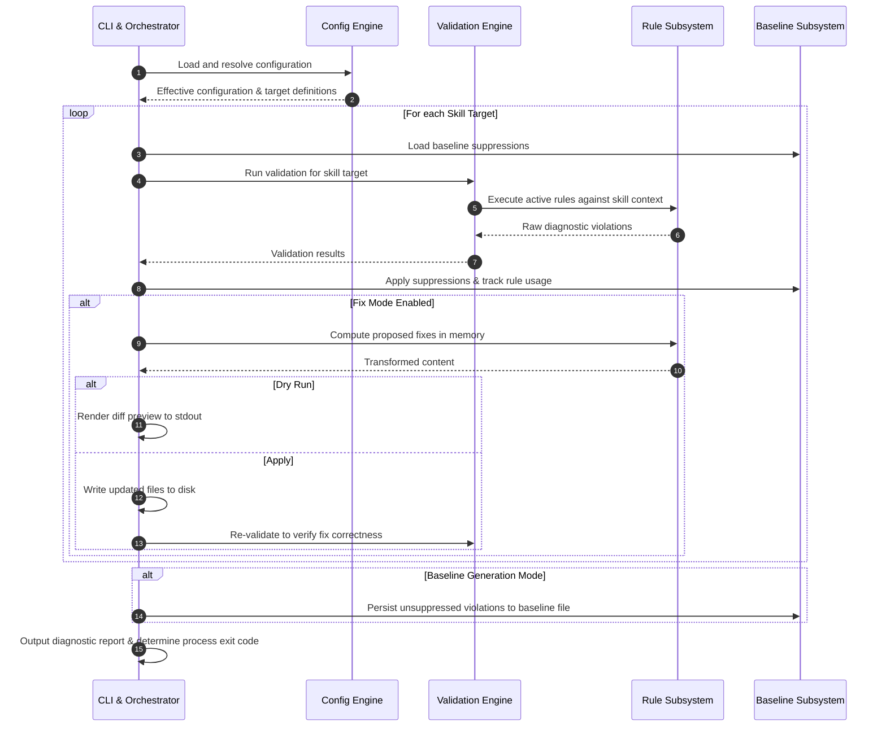

# Architecture Overview: Agent Skills Linter (`skills_lint`)

This document provides a high-level architectural overview of the `skills_lint` codebase. It outlines the core architectural boundaries, execution lifecycle, durable design patterns, and rejected anti-patterns.

## 🧱 Architectural Boundaries

The system is organized into decoupled layers, separating command-line orchestration, configuration management, pure validation logic, and suppression persistence.

### 1. CLI & Orchestration Layer
The orchestration layer manages the execution session from invocation to termination.
- **Invocation & Environment Discovery:** Parses command-line inputs, discovers target skill directories (resolving workspace defaults when no explicit targets are provided), and manages process exit codes.
- **Session Coordination:** Coordinates validation across multiple targets, manages execution flags (such as fast-fail and output verbosity), and oversees the lifecycle of automated fixes and baseline generation.
- **Console Reporting:** Formats structured validation diagnostics into user-facing console output, diff previews, and exit signals.

### 2. Configuration & Resolution Engine
Responsible for loading, validating, and resolving user settings across different scopes.
- **Schema & Target Parsing:** Loads repository-level configuration and parses per-directory or per-skill overrides.
- **Hierarchical Precedence:** Resolves effective rule sets and parameter values deterministically by layering scopes: CLI overrides take highest precedence, followed by path-specific target configurations, global repository configurations, and built-in defaults.

### 3. Stateless Validation Engine
The core analysis engine responsible for inspecting individual skills.
- **Context Extraction:** Ingests skill directories, parses metadata frontmatter and Markdown content into structured representations, and captures low-level parsing or syntax errors.
- **Rule Dispatch:** Iterates over the active rules for a given skill context and aggregates emitted diagnostic results.
- **Purity & Isolation:** Operates as a pure analysis unit without side effects, remaining entirely decoupled from CLI arguments, terminal I/O, or session orchestration.

### 4. Rule Subsystem & Extensibility
The extensible framework for authoring and running skill checks.
- **Diagnostic Rules:** Independent rule checkers that validate specific constraints (such as metadata schemas, directory layout, path portability, and naming conventions).
- **Auto-Fix Interface:** Rules that support automated remediation define pure transformation operations, taking current file content and returning modified content without directly touching the filesystem.

### 5. Baseline & Suppression Subsystem
The persistent suppression mechanism enabling incremental adoption and legacy skill management.
- **Structured Suppressions:** Stores and matches ignored diagnostics using structured identifiers and file paths rather than brittle free-form string matching.
- **Lifecycle Tracking:** Records new baseline entries when requested and tracks active suppression usage during lint runs to report stale or obsolete entries.

---

## ⏳ Execution Lifecycle

The high-level lifecycle follows a staged pipeline:

---

## 🧠 Durable Design Patterns

1. **Separation of Validation from Orchestration**  
   The validation engine and individual rules are pure, deterministic functions of a skill's filesystem state. They never interact with terminal streams, environment variables, or process lifecycles. All output formatting, fix persistence, diff rendering, and exit code determination belong exclusively to the orchestrator.

2. **Deterministic Layered Inheritance**  
   Configuration settings and rule parameters merge cleanly across scopes. Narrower scopes (e.g., target-specific settings or CLI flags) override broader defaults without unintentionally resetting unrelated sibling parameters.

3. **Two-Phase Fix & Verification Lifecycle**  
   Remediation is always split into two distinct phases: in-memory transformation and subsequent re-validation. Rules produce candidate fixes as data rather than performing disk writes. When fixes are applied, the orchestrator immediately re-validates the target to ensure the fix resolved the error without introducing regressions.

4. **Structured Baseline Auditing**  
   Suppression baselines rely on stable rule identifiers and relative file paths rather than fragile log message matching. Baselines are actively audited during execution to identify stale suppressions when violations are fixed.

---

## 🚫 Rejected Anti-Patterns & Common Pitfalls

The following patterns have been explicitly rejected in this codebase:

- **Leaking CLI or Process State into Rules:** Rules must never inspect command-line arguments, environment variables, or global process state. All required context and configuration must be passed via structured context and parameter objects.
- **In-Place File Mutations Inside Rules:** Rules must never perform raw disk writes, delete files, or execute subprocesses during validation. Auto-fixing rules must return proposed modifications to the orchestrator.
- **Brittle Message Matching for Suppressions:** Never match error messages or log text to filter suppressions. Suppressions must always use structured rule IDs and file boundaries.
- **Platform-Dependent Path Handling:** Hardcoded path separators (such as `/` or `\`) or assumptions about POSIX shell behavior break Windows compatibility. All path operations must use platform-agnostic path utilities.
- **Non-Dart Tooling & Scripts:** Introducing Python, shell, or JavaScript scripts for test harnesses, evaluation fixtures, or developer automation violates the repository-wide Dart-only policy. All automation and tooling must be authored in Dart.
- **Ad-Hoc Magic Literals:** Hardcoding CLI flags, YAML keys, configuration names, or diagnostic identifiers inline creates maintenance drift. All identifiers, options, and error codes must be defined as centralized constants.
