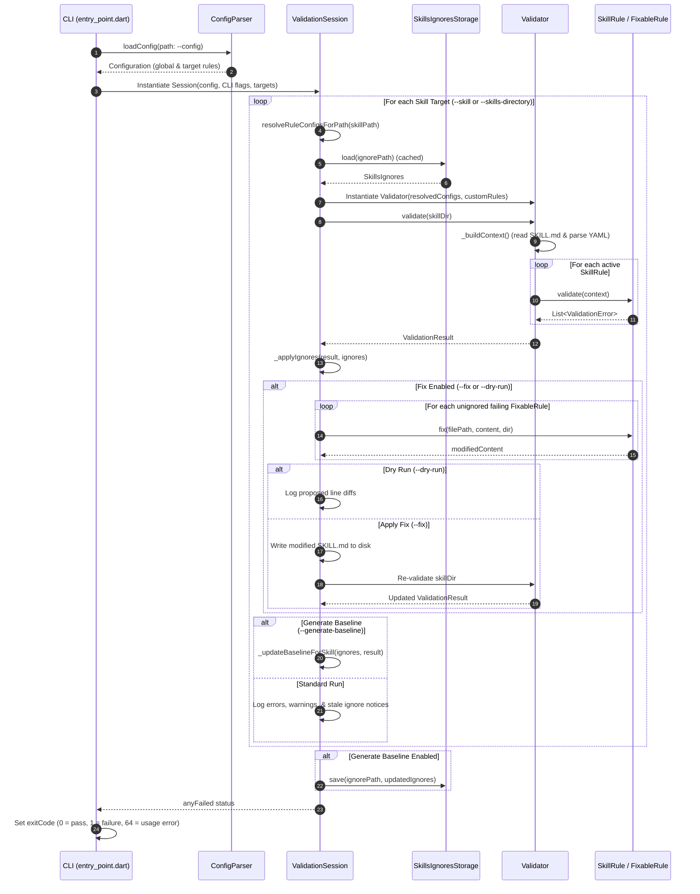

# Architecture Overview: Agent Skills Linter (`skills_lint`)

This document provides a high-level architectural overview of the `skills_lint` codebase. It outlines the package components, execution lifecycle, rule execution model, and design patterns used to validate Agent Skill specifications.

## 🧱 Key Components

The codebase is organized into modular Dart package layers separating CLI handling, session orchestration, configuration parsing, validation execution, rules, and data models.

```
bin/
└── skills_lint.dart              # CLI Executable Entry Point
lib/
├── skills_lint.dart              # Public API Exports
└── src/
    ├── entry_point.dart          # CLI Argument Parsing & Runner Setup
    ├── config_parser.dart        # YAML Configuration Loader (skills_lint.yaml)
    ├── validation_session.dart   # Central Orchestrator & Session State
    ├── validator.dart            # Pure Validation Engine (SkillContext Builder)
    ├── rule_registry.dart        # Registry & Factory for Built-In Rules
    ├── fixable_rule.dart         # Interface for Auto-Fixable Rules
    ├── skills_ignores_storage.dart # Ignore File I/O Persistence Service
    ├── rules/                    # Concrete SkillRule Implementations
    └── models/                   # Core Data Models & Schemas
```

---

### 🚗 1. CLI Entry Point (`bin/skills_lint.dart` & `lib/src/entry_point.dart`)
- **Executable Entry:** `bin/skills_lint.dart` exposes `main()`, delegating directly to `runApp()` in `lib/src/entry_point.dart`.
- **Argument Parsing:** Uses `package:args` to parse command-line arguments:
  - **Targets:** `--skills-directory` / `-d` (multi-option) for container directories; `--skill` / `-s` (multi-option) for individual skills.
  - **Configuration:** `--config` / `-c` (custom config path, defaults to `skills_lint.yaml`), `--ignore-config`.
  - **Execution Controls:** `--fast-fail`, `--quiet` / `-q`, `--print-warnings` / `-w` (defaults to true).
  - **Baseline Ignores:** `--ignore-file` (override baseline path), `--generate-baseline` (generates `skills_lint_ignore.json`).
  - **Auto-Fix System:** `--fix` (writes fixes to disk), `--dry-run` (previews line diffs when combined with `--fix`), `--fix-apply` (deprecated alias for `--fix`).
  - **Dynamic Rule Flags:** Generates `--[no-]<rule-name>` toggle flags and namespaced parameter flags (`--<rule-name>-<param-name>`, e.g., `--path-does-not-exist-exclude`) dynamically from `RuleRegistry.allChecks`.
- **Target Resolution:** Prioritizes explicit CLI targets (`--skill`, `--skills-directory`), then configured YAML targets (`directories`, `individual_skills`), and falls back to auto-discovering `.claude/skills` or `.agents/skills`. If no targets exist, raises `MissingDefaultsException` and displays a first-run guide with exit code 64.
- **Programmatic API:** Exposes `validateSkills()` for embedding in test suites and external Dart tools.

---

### ⚙️ 2. Configuration Parser (`lib/src/config_parser.dart`)
- **File Discovery:** Loads repository-wide configuration from `skills_lint.yaml` (or custom path via `--config`).
- **Schema Validation:** Enforces the `skills_lint` root namespace with allowed top-level keys: `rules`, `directories`, and `individual_skills`.
- **Per-Target Overrides:** Targets under `directories` and `individual_skills` support `path`, `rules`, and `ignore_file`.
- **Rule Configurations:** Parses rule definitions as simple severities (`rule: error`) or structured maps with custom parameters (`rule: { severity: error, param: value }`), validating parameters against each check's `parameterSchema`.
- **Data Structures:** Produces `Configuration` containing `List<LintTargetConfig> directoryConfigs`, `List<LintTargetConfig> individualSkillConfigs`, `Map<String, RuleConfigPatch> ruleConfigs`, and `List<String> parsingErrors`.

---

### 🎛️ 3. Validation Session Orchestrator (`lib/src/validation_session.dart`)
`ValidationSession` is the stateful orchestrator instantiated once per run:
- **Hierarchical Rule Resolution:** Computes the effective `RuleConfig` for each target path using 4-tier precedence:
  1. *CLI Flags & Parameters* (`RuleConfigPatch`)
  2. *Path-Specific YAML Config* (`directories` / `individual_skills`)
  3. *Global YAML Config* (`skills_lint.rules`)
  4. *Rule Registry Defaults* (`CheckType.defaultSeverity`)
- **Ignore Baseline Management:** Resolves target ignore paths (defaulting to `skills_lint_ignore.json`), loads/caches `SkillsIgnores`, applies suppressions (`_applyIgnores`), and tracks `used` status on `IgnoreEntry` instances to report stale suppressions.
- **Auto-Fix & Diff Workflow:** Coordinates `FixableRule` execution on unignored errors, prints line diffs in `--dry-run` mode, or writes modified content to disk and re-validates in `--fix` mode.
- **Baseline Generation:** When `--generate-baseline` is enabled, records all unignored errors into `SkillsIgnores` and writes them to disk via `SkillsIgnoresStorage`.
- **Failure & Exit Code Tracking:** Aggregates `anyFailed` across all processed skills and enforces `--fast-fail`.

---

### 🛡️ 4. Validation Engine (`lib/src/validator.dart`)
`Validator` is a stateless, pure validation unit created per skill directory:
- **Context Construction:** Reads `SKILL.md`, parses YAML frontmatter with `SkillContext.skillStartRegex` (`dotAll: true`) and `loadYaml`, and constructs a `SkillContext`. Handles disk I/O and unexpected syntax errors gracefully (`skill-file-inaccessible`, `unexpected-error`).
- **Rule Dispatch:** Iterates over active `SkillRule` instances, executing `rule.validate(context)`. If `SKILL.md` is missing, only runs `PathDoesNotExistRule` to prevent cascading errors.
- **Result Aggregation:** Wraps results and context into a `ValidationResult`.

---

### 📜 5. Rule Registry & Rule System (`lib/src/rule_registry.dart`, `lib/src/rules/`, `lib/src/fixable_rule.dart`)
- **Rule Registry:** `RuleRegistry.allChecks` maintains the list of built-in `CheckType` definitions. `createRule(name, severity, parameters)` dynamically instantiates rules.
- **Polymorphic Rule Hierarchy:**
  - `SkillRule`: Abstract base class requiring `name`, `severity`, and `validate(SkillContext)`.
  - `FixableRule`: Interface extending `SkillRule` requiring `Future<String> fix(String filePath, String currentContent, Directory directory)`.
- **Built-In Rules:**
  - `path-does-not-exist` (`PathDoesNotExistRule`): Validates directory existence and mandatory `SKILL.md` (supports regex parameter `exclude`).
  - `invalid-skill-name` (`NameFormatRule`): Enforces lowercase alphanumeric naming, character constraints, and directory-name matching (Fixable).
  - `description-too-long` (`DescriptionLengthRule`): Enforces max 1024-character frontmatter description.
  - `valid-yaml-metadata` (`ValidYamlMetadataRule`): Checks YAML syntax, required `name` and `description` fields, and max 500-character `compatibility` length.
  - `check-absolute-paths` (`AbsolutePathsRule`): Detects non-portable absolute Markdown links (Fixable).
  - `check-relative-paths` (`RelativePathsRule`): Validates relative link targets exist on disk with near-miss sibling suggestions.
  - `check-trailing-whitespace` (`TrailingWhitespaceRule`): Enforces no trailing whitespace except exactly 2 spaces for Markdown hard breaks (Fixable).
  - `disallowed-field` (`DisallowedFieldRule`): Restricts frontmatter to spec-allowed fields.
  - `prevent-skills-sh-publishing` (`PreventSkillsShPublishingRule`): Ensures `metadata.internal: true` is set.
- **Custom Rules:** Custom `SkillRule` implementations can be passed programmatically via `customRules`.

---

### 📦 6. Core Data Models (`lib/src/models/`)
- **`SkillContext`:** Encapsulates the target `Directory`, `rawContent` of `SKILL.md`, `parsedYaml` map, and parsing errors.
- **`ValidationError`:** Records `ruleId`, `file`, `message`, `severity`, and `isIgnored` status.
- **`ValidationResult`:** Aggregates `List<ValidationError>`, `SkillContext`, and exposes `isValid`, `errors`, and `warnings`.
- **`RuleConfig` & `RuleConfigPatch`:** Combines `AnalysisSeverity` with `CustomRuleParameters`, supporting layered inheritance.
- **`CustomRuleParameters`:** Type-safe wrapper for rule parameters (`getString`, `getInt`, `getBool`, `getStringList`).
- **`RuleParameterType`:** Enum (`string`, `integer`, `boolean`, `stringList`, `regExp`) for parameter validation.
- **`CheckType`:** Schema defining rule name, default severity, help string, and parameter schemas.
- **`SkillsIgnores` & `IgnoreEntry`:** Serializable models for `skills_lint_ignore.json` with runtime `used` tracking.
- **`SkillsIgnoresStorage`:** Service for reading and writing formatted JSON ignore files.

---

## ⏳ Execution Lifecycle



---

## 🧠 Design Principles

- **Separation of Concerns:** `Validator` is a stateless validation motor independent of CLI flags, file discovery, or ignore persistence. `ValidationSession` handles orchestration, configuration inheritance, auto-fixing, and baseline synchronization.
- **Hierarchical Rule Resolution & Parameter Inheritance:** Rules and parameters are layered deterministically: CLI overrides > target YAML (`directories`/`individual_skills`) > global YAML (`rules`) > built-in defaults. Unspecified parameters in higher layers inherit from base layers without being erased.
- **Two-Phase Fix & Verification Lifecycle:** `FixableRule`s operate purely on content strings and directory paths without side effects. `ValidationSession` manages the diff preview or disk write, immediately re-running validation to ensure applied fixes fully satisfy constraints.
- **Two-Way Ignore Baseline Synchronization:** The ignore system supports automated recording (`--generate-baseline`) and active staleness auditing during lint runs, preventing obsolete suppressions from accumulating.
